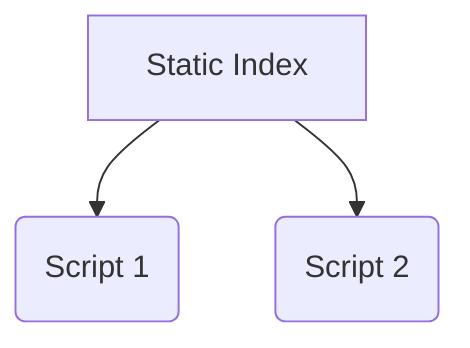
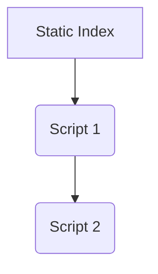

First Scenario: Both scripts called inside the same index file

```mermaid
graph TD
    A[Static Index] -->B(Script 1)
    A[Static Index]-->C(Script 2)

```

Second Scenario: Second script is called inside the first script

```mermaid
graph TD
    A[Static Index] -->B(Script 1)
    B -->C(Script 2)

```

Third Party JS Eval functions

